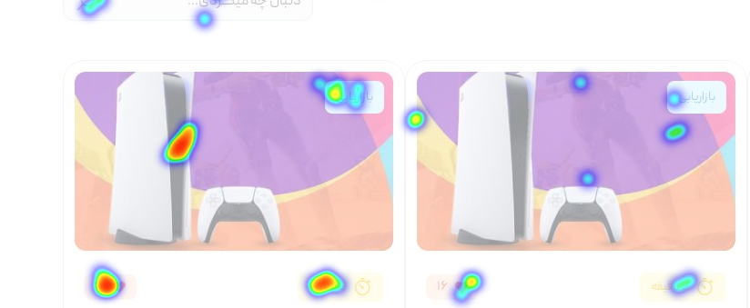

  

  
  <!--  Title  -->
  
  <h1>تالیو</h1>
  📌
  در این ریپازیتوری سعی شده است توضیح مختصری در مورد تکنولوژی و راه کار هایی که سرویس تالیو اراعه میدهد داده شده باشد
  
  <!--  /Title  -->
  
  <!-- Linked repositories -->
  
  ### ریپازیتوری های لینک شده
  
  <a href="https://github.com/evokelektrique/talio-api">API (Elixir Phoenix Framework)</a>
   
  <a href="https://github.com/evokelektrique/talio-screenshot">Screenshot API (NodeJS)</a>
   
  <a href="https://github.com/evokelektrique/talio-helper">Heatmap (Javascript)</a>
   
  <a href="https://github.com/evokelektrique/talio-client">Recorder</a>  
  
  <!-- /Linked repositories -->
  
     
  
  <!--  Heatmap  -->
  
  <h1>هیت مپ / نقشه حرارتی 🔥</h1>
  

    
  

  نقشه حرارتی، ابزاری برای تجسم داده ها است که به صاحبان وب سایت ها کمک می کند تا عملکرد یک صفحه خاص را بررسی کنند.
   
  هیت مپ، مجموعه ای از داده های پیچیده را به صورت تصاویری با رنگ های مختلف نمایش می دهد تا فهم آن ها را ساده تر کند
  
    
  
  <b>:انواع هیت مپ هایی که تالیو اراعه میدهد</b>
  <ul dir="ltr">
    <li>Click Maps ✔️</li>
    <li>Move Maps ⬜ (soon)</li>
    <li>Hover Maps ⬜ (soon)</li>
  </ul>
  
  <!--  /Heatmap  -->
  
     
    
    
  <!--  Lab  -->
  
  <h1>🥼 آزمایشگاه</h1>
  در این قسمت میخواهم شمارو با تکنولوژی هایی که در تالیو به کار برده شده آشنا بکنم
   
  برای سرعت بخشیدن به توسعه از روش SOA(Service Oriented Architecture) و از زبان های Elixir, NodeJS, TypeScript و همچنین از سرویس Minio برای ذخیره سازی داده با تکنولوژی S3 استفاده شده است.
    
  ❓
  حال شاید برای شما سوال شده باشد که چرا از Elixir استفاده کردید و از زبان هایی مانند Python, Go, Ruby استفاده نکردید و آن ها پر طرفدار تر هستند
    
  <blockquote>
  بزرگی را جز به دانایی مپندار
  </blockquote>
   
  زبان برنامه نویسی Elixir یک Transpiler برای زبان Erlang با سینتکس فوق العاده آشنا (Ruby) ساخته شده برای راه حل های مخابراطی.
   
  <a href="https://www.phoenixframework.org/blog/the-road-to-2-million-websocket-connections">مطلب جالبی در مورد رکورد زدن در وب سوکت</a>
    
  همچنین دلیل استفاده از این زبان برنامه نویسی خوبی آن در پیشبینی در تاخیر / Latency prediction می باشد که حتی شرکت Discord زبان Elixir را بجای Go انتخاب کرد به همین دلیل.
    
  در تالیو ما داده ها را در بستر WebSocket انتقال میدهیم که سرعت فوق العاده زیادی هم دارد.
   
  برای مثال در زبان های دیگه وقتی حرف از سرعت میشود معمولا در بازه <b>میلی ثانیه</b> گفتگو میکنند اما در Erlang/Elixir از <b>میکروثانیه</b> صحبت میشود
   
  بله درست خواندید میکروثانیه(μs) سرعت پذیرفتن سوکت ها در Elixir در میکروثانیه ثبت میشوند
    
  و همچنین ساختار Erlang به شکلی است که برنامه شما غیر قابل Crash می باشد و هر پروسه(با پروسه های سیستم عامل اشتباه نشود) حامل داده و پردازش آن می باشد و هرکدام از آن پروسه ها زیر نظر Supervisor به تعداد هر هسته CPU می باشند که نظاره گر مشکلات و حل کردن مشکلات طبق Strategy که برای آن نظاره گر تعریف شده می باشد.
    
  با استفاده از Timescaledb توانستیم سرعت Write/Read بیش از ۲ برابر سرعت معمولی دیتابیس Postgresql دستیابی بکنیم.
    
  امیدوارم این مطلب برای شما مفید واقع شده باشد.
  
  <!--  /Lab  -->
  

